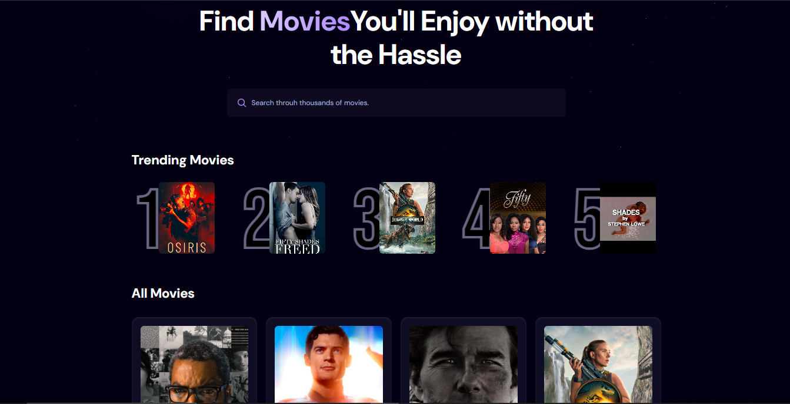

🎬 Movie List App (React + Vite + TMDB API)

This project is a React app built with Vite that lets you browse movies, view trending lists, and search titles using The Movie Database (TMDB) API.
It also uses icons and styled components to make the UI clean and modern. 🚀

⚡ Features

🔥 Trending Movies – fetches the most popular movies from TMDB.

🔎 Search Functionality – look up movies by title.

🖼️ Movie Posters – displays poster images with TMDB image API.

❤️ Icons – added using Lucide React
(or FontAwesome/React Icons).

⚡ Built with React + Vite for fast development.

🛠️ Tech Stack

React 18 (frontend framework)

Vite (bundler, super fast HMR)

TMDB API (movie data)

Lucide React / React Icons (icons)

TailwindCSS (optional, for styling)
